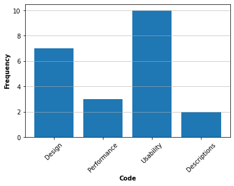
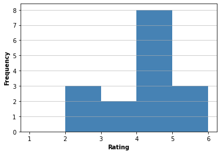
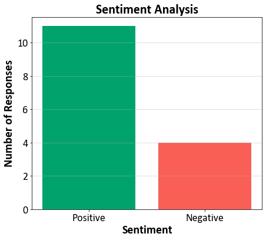

# website_thematic_analysis

- I built a small website for my team and wanted to get some feedback on it. I did this using a simple questionnaire of free text and ratings.
- This code involves a thematic and sentiment analysis of this feedback to identify themes and patterns. The analysis was carried out in accordance with Braun and Clarke's (2006) guidelines.
  - The NLTK Python library was used for natural language processing, and the Pandas library was used for data manipulation.
  - The feedback was pre-processed using the WordNetLemmatizer to reduce words to their lemma, and a custom set of stopwords was used to filter out irrelevant words.
  - This work also includes a sentiment analysis of the free text, classifing the sentiment polarity of a text to positive or negative.
  - A binomial test is used to check whether the number of positive sentiments is significantly different from 50%.

